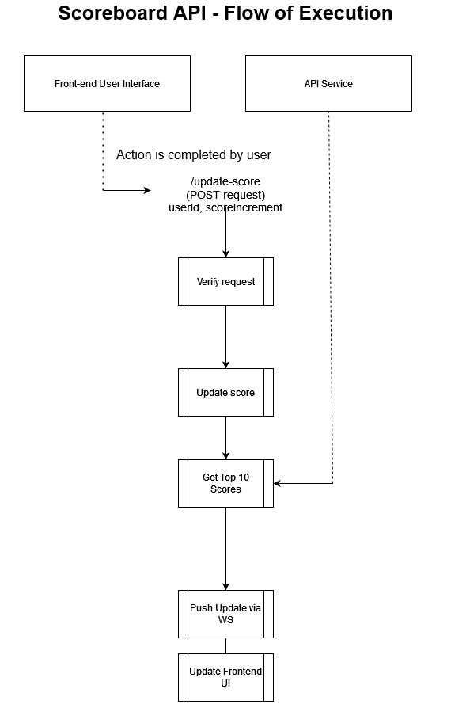

# Scoreboard API
The Scoreboard API Service securely updates user scores shown on a website's scoreboard in real time. The API ensures that all updates to the score are securely done and by the authorized party only, without any kind of unauthorized manipulation.

## Table of Contents 📝

- [Features](#features)
- [API Endpoints](#api-endpoints)
- [Flow Execution](#flow-of-execution)
- [Security concerns](#security-concerns)
- [Technologies used](#technologies-used)
- [Additional comments](#additional-comments)


## Features
- **Score update API**:  Updates the scores of *authenticated* users after they complete a certain action.
- **Top 10 Scoreboard**: Displays and updates the top 10 user scores in real-time using WebSockets or Server-Sent Events (SSE) to push live data.
- **Authentication**: Using a token-based application, ensures that only authenticated users can have their scores updated.

## API Endpoints
### 1. Updating user's score
### ``POST /update-score``
- Request:
```
{
  "userId": "110",
  "scoreIncrement": 50
}
```
- Response:
```
{
  "status": "success",
  "newScore": 300,
  "topScores": [
    { "userId": "110", "score": 300 },
    { "userId": "123", "score": 250 },
    ...
  ]
}
```
### 2. Finding top 10 best scores
### ``GET /top-scores``
- Response:
```
{
  "topScores": [
    { "userId": "110", "score": 300 },
    { "userId": "123", "score": 250 },
    { "userId": "124", "score": 200 },
    ...
  ]
}
```


### 3. Highlighting top user (Optional)
While this would not be completely necessary (as the scoreboard is in descending order) highlighting the #1 user may help the front-end team if they need to design something specific for the user on top. This can be done by adding a boolean value to track the top user:
```
{
  "topScores": [
    { "userId": "123", "score": 300, "isTopUser": true },
    { "userId": "456", "score": 250, "isTopUser": false },
    { "userId": "789", "score": 200, "isTopUser": false },
    ...
  ]
}
```

### 4. User Ascension/Descension Tracking (Optional)
Inspired by other applications that have scoreboards (such as Duolingo), we might add a tracker so that users will be able to see how their rank changes over time, adding more competition to the experience.
#### Suggestions
- Adding a ``previousRank`` field to store each user's previous rank on the scoreboard and eventually compare.
    - When calculating the top 10 scores, update this field **before** updating the new rank.

-  #### Calculating Rank Movement
    Whenever the user's score is updated:
    - Fetch the previous rank from the database.
    - Calculate the user's new rank after the score update.
    - Compare the new rank with the previous rank:
    - If the new rank is better, the user has ascended.
    - If the new rank is worse, the user has descended.

- #### API response
```
{
  "topScores": [
    { "userId": "123", "score": 300, "previousRank": 2, "currentRank": 1, "movement": "ascended" },
    { "userId": "456", "score": 250, "previousRank": 1, "currentRank": 2, "movement": "descended" },
    { "userId": "789", "score": 200, "previousRank": 3, "currentRank": 3, "movement": "same" },
    ...
  ]
}
```
The `` movement`` value will show whether the user has *ascended*, *descended*, or stayed the *same* on the leaderboard.

## Flow of execution
 [](src\problem6\diagram-for-scoreboard.png)

### 1. User Action & API Call:
User completes action, triggering a ``POST`` request to ``/update-score``, sending the ``userId`` and ``scoreIncrement``.

### 2. Backend Authentication & Validation:
API verifies the user's authentication token and validates the request body. If valid, it adds to the score.

### 3. Score Update:
User's score is updated in the database.

### 4. Top 10 Scores:
After updating the user's score, the system finds the current top 10 scores, caches the result, and sends it to client.

### 5. Real-time Update to Frontend:
The updated top 10 scores are pushed to the frontend via WebSockets or SSE, ensuring the scoreboard updates dynamically without the need to reload the page.

PS:
If the [rank movement](#4-user-ascensiondescension-tracking-optional) suggestion is considered, add this to the flow:
### 3.1. Compare the new position with the previous position
System compares user's new score to previous score and rank, determining whether they have ascended, descended or maintained their position.

## Security concerns
- **Authentication & Authorization**:
Implement using OAuth2 or JWT to ensure only authorized users can update their scores.
- **Rate limiting**: Limit how frequently a score can be updated to prevent possible abuse by user.
- **Monitor logging**: Ensure that users can only update their scores if they are correctly logged in their accounts.

## Technologies used 
A simple list of what languages and technologies may be used in this API.
- **Framework**: Node.js / Express or Python / Flask
- **Database**: PostgreSQL
- **Real-time updates**: WebSockets, Server-Sent Events (SSE)
- **Security**: OAuth2, JWT, Input Validation, Rate Limiting

## Additional comments
- **Batch Score Updates**: If the action performed by the user is frequent then rather than updating the database on every action, consider batching score updates. This would reduce the number of write operations on the database and improve the overall perfomance.
- **Prevent replay attack**: Use nonce or timestamp validation in requests to prevent replay attacks where malicious actors might repeat a valid score increment request multiple times.


